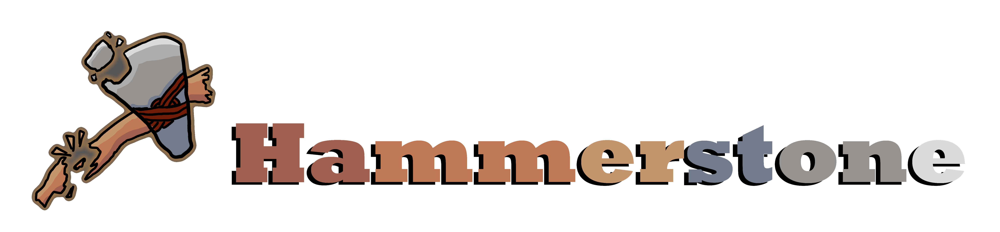

# Hammerstone Mod Framework

Hammerstone is a modding API and framework for the Sapiens video game. It aims to improve compatibility between mods and provide several useful features to mod developers. It has no functionality by itself. 

## Installing
Hammerstone has many different versions, and it can be installed a variety of ways.

### Steam Workshop
The Steam Workshop is the officially-supported way of installed Hammerstone. By going to it's [Steam Workshop page](https://steamcommunity.com/sharedfiles/filedetails/?id=2840825226) and click 'Subscribe', the game will automatically download the mod for you.

### GitHub (manual)
If you need more control over the version, or need bleedging-edge features, you can clone this repository to your mods folder. Depending on your platform, the location you need to download it to changes:
| Platform       	| File Path                                                                                                           	|
|----------------	|---------------------------------------------------------------------------------------------------------------------	|
| Windows        	| `%AppData%\majicjungle\sapiens\mods`                                                                                	|
| MacOS          	| ?                                                                                                                   	|
| Linux (Proton) 	| `~/.steam/steam/steamapps/compatdata/1060230/pfx/drive_c/users/steamuser/AppData/Roaming/majicjungle/sapiens/mods/` 	|

## Developers
Hammerstone has extensive documentation on the interfaces it provides. It can be found over on the [Sapiens Modding Wiki](https://wiki.sapiens.dev/). 

## Credits
A massive thank you for SirLich for starting the project, the contributors listed on the GitHub repository, and the Sapiens modding community as a whole.